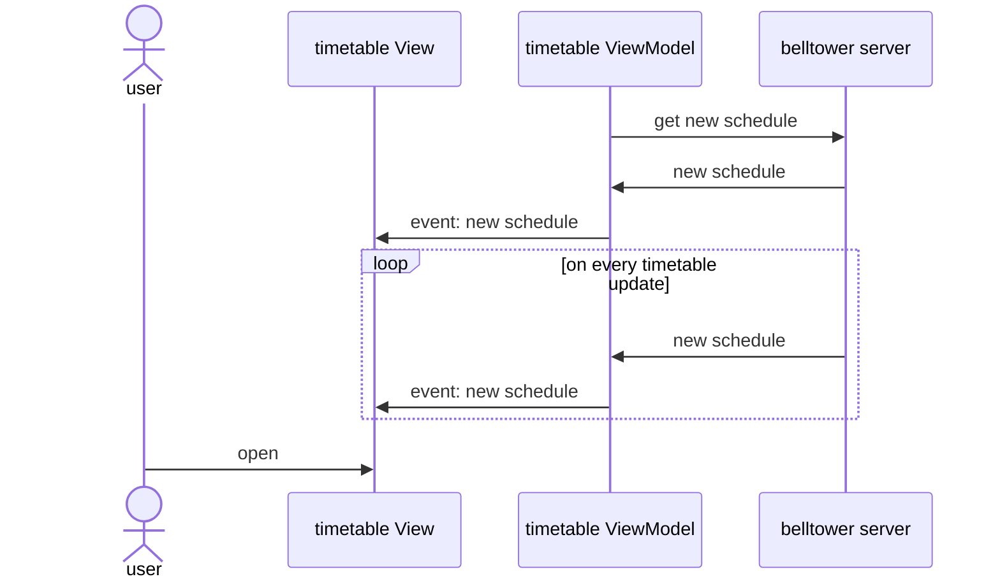
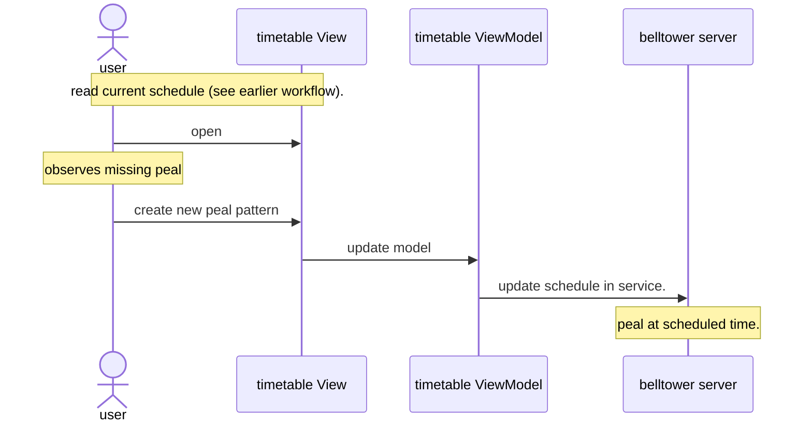
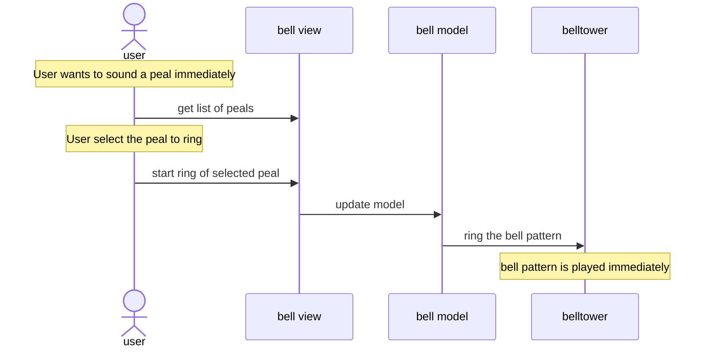
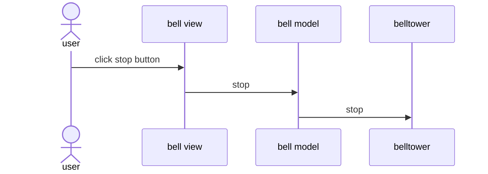

# User interface for belltower

Controls for
- ringing bells
- accessing bells timetable
- get status of the bell pattern player

To use the same code base for web and embedded display,
javafx is the UI programming technology.

For low memory footprint and dependency injection,
Quarkus is the overall development platform.

## Belltower Scene
The application would open with a read only status scene.
This contains:
- general events describing overall status change over time
- display describing overall instantaneous status
  - status of time service
  - status of remote service that provides timetable

## Timetable Scene

The Timetable Scene has functions to read the bell timetable.
The timetable gives the time and bell pattern to play.

## Belfry Scene

The Belfry scene gives details of the bell status,
whether it is idle or playing a pattern,
and what pattern it is playing.

## Login Scene

Collects credentials and drives a backend call to authentication and authorization.

# Workflows

## Scheduling

### Viewing time and pattern of upcoming peals

As a user, I'd like to know the next scheduled peal,
the time it will ring and its name.
Then I can confirm the bell tower will ring the bell
at the next intended scheduled time.

At startup, the timetable viewModel will initialize and
get the latest schedule from the server.
Then, the viewModel will register for events
from the server when the schedule changes.
Thereafter, the viewModel updates the view when schedule changes.
When the user opens the view, the data is already present
and so is displayed immediately.

This flow presents the upcoming schedule peals to the user.
The view can show one or more upcoming peals.
The time and pattern name of each is displayed in the view.

### Editing the onboard schedule

As a scheduler, I'd like to define an onboard peal schedule.
The onboard schedule can be used instead of an online schedule,
or when the online schedule is not available or disabled.

To build the onboard peal schedule,
I should be able to:
* create and remove repeatable peal times,
* create and remove peal times as offset from the start or end of the month,
* remove an particular instance of a repeatable time,
* create non-repeatable peal times.

The timetable as a whole should be saved after each
full date/time and peal added or deleted.

* get list of bell patterns (call to mass, wedding, funeral)
  * UI: belfry, timetable (at edit time)
  * API: pattern list
* add/delete/change onboard schedule
  * UI: probably a different timetable panel (too much controls to fit)
  * API: maybe direct to google calendar?

## Immediate care

### add a peal to schedule

When a peal is missing from the schedule,
I'd like to add a peal pattern to the schedule
to ring in time within the next 5 to ~40 minutes.
This will let me cover up for scheduling mistakes
which are discovered too late.

An aid to the edit would help user select
a time at the top and bottom of the hour
which is aligned with the usual start time of worship services.

### ring a peal immediately

As a user with rights to ring the bell,
I'd like to push a button to ring
any available peal immediately.

### Stop current peal immediately

I want to stop the peal as soon as possible.

## Administration

* health readout (most if not all on belltower/main panel)
  * to confirm tower will play next scheduled pattern at the right time
    * UI: belltower panel
  * to show tower has upto date schedule
    * UI: belltower panel
  * to show tower has the correct time
    * UI: belltower panel
  * tower can report the last missed scheduled bell play
    * comparing schedule to actual
  * show tower can connect to network
  * show tower is connected with media player (mpd)
  * time of last restart
  * time of last network outage and duration
  * show logs
    * result of getting schedule
    * restart/reboot
    * requests to ad hoc ring
* soft restart (reset short of a reboot)
* hard restart (reboot)
* get authorization to access google calendar
* default schedule (built-in to run while network is unavailable)
* remembers the last schedule download in case there is:
  * network outage
  * power outage and restoration
* login/authorization
  * times out.
  * authorization levels
    * monitor - read only
    * ringer - immediate rings, schedule edits
    * system - user management, reboots

# Security requirements

Unauthenticated users can:
- read timetable
- read overall system status
- read bell status

Authenticated users can:
- ring bell patterns on command
- restart the application
- reboot the operating system

# Program Design notes

The view-model-viewmodel pattern is maintained.

* The view is the set of UI controls on a javafx scene which is comprised of:
  * an fxml file,
  * and a java class (View)
* The viewmodel are the observers and callbacks between the view and the model.
It decouples the UI control from the model.
* The model is the logic which can obtain and present data to the view
and perform tasks.  This layer must remain isolated from the UI controls
via the viewmodel.

Decoupling is further supported by CDI injection.

The CDI bean manager is registered to javafx to
instantiate the View controllers at fxml load time.

