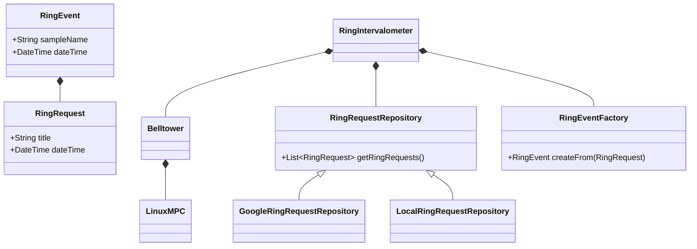

# belltower Project

Plays bell samples on-demand or automatically by a schedule.
The system is customized for use by a faith community to ring bells,
or other suitable sound samples,
for various liturgical occasions.
The software may be unsuited for other applications.

The project does not include audio amplifier or speakers.
This project produces only computer software.


## Runtime Requirements

The belltower program requires the following at runtime:
- an audio sound system: amplifier and speakers
  - with audio input to match the signal presented by the computer below
  - with volume and optionally mixing controls
  - with speakers, sized and mounted appropriately for desired reach of the playback.
- a desktop computer or a single-board computer running linux
  - with internet access
  - with a sound card and audio output to match the signal required by the sound system above
  - a display screen
- linux operating system on the computer with some configuration and software, including
  - java runtime
  - mpd (music player daemon)
  - appropriate audio configuration to drive the sound card output suited for the audio sound system.

## User Stories

As a bell ringer, I'd like to 'ring', or play, media samples of bells,
to increase the sense of community of a congregation,
and to retain the tradition of ringing bells after replacing actual bells with modern technologies.

As a bell ringer, I'd like to schedule bell samples to ring automatically,
so I can be relieved of the manual chore of ringing the bells manually.

As a bell ringer, I'd like to ring bells manually on demand,
so they can sound at times which are not planned and scheduled.

As a bell ringer, I'd like to have different bell samples available to play,
so that the bells sounded are appropriate for the occasion.

# Configuration
belltower.calendar.query.lookAhead - on query to calendar,
obtain events from now until the look ahead value.
The look ahead value is expressed as in a string formatted
as according to [Java Duration#parse](https://docs.oracle.com/javase/8/docs/api/java/time/Duration.html#parse-java.lang.CharSequence)

belltower.intervalometer.schedule.refresh.period:2h
The period between refreshes of the schedule from
all source.  Default is 2 hours.

belltower.call-to-mass.duration - The time to start the 'call-to-mass'
bell sequence.
The event on the schedule is spelled 'mass',
and 'call-to-mass' bells are started this duration before the time
of the 'mass' event.
This is convenience so the calendar need only to detail
the time mass starts.
The belltower program has a special rule for this event:
start the bells some duration before start of mass.
This duration is expressed in a string formatted according
to [Java Duration#parse](https://docs.oracle.com/javase/8/docs/api/java/time/Duration.html#parse-java.lang.CharSequence)

belltower.calendar.id - the id of the Google calendar from which scheduled events are read.

belltower.calendar.path.client-secrets - path to json file which holds credentials to

belltower.mpd.port - port to send mpc requests, defaults to 6600.

belltower.mpd.host - host to send mpc requests, defaults to localhost.

# Control surfaces

The belltower supports ringing on demand,
or on some interval (at 7:30 every morning),
or at specific dates and times in the future (4 pm on Christmas Eve, 2020).

Note: intention to offer web based control with https,
and embedded local control with a UI based on javafx.
* on demand by embedded local control
* by interval or on singular date and time by remote calendar.

# Media samples

The belltower is essentially a media file player.
The media files contains audio samples of some sequence of bells rinning.

The samples should be clean without backend noise like city traffic or conversations.

The samples can be proprietary and created by a sound engineer.
Samples unencumbered by restrictive copyrights are distributed with the software.

The tower can work with two kinds of samples:
* a fixed duration sample: 
playing a single sample file is played from beginning to end.

* a veriable duration sample - three samples are played in sequence
and the middle sample is repeated until the requested duration is played.
The technique requires careful editing of the three samples for seamless playback.

# Remote control

Some controls can be accessed remotely and securely through connections to the Internet.

- remote scheduling allows a user to change the bell schedule remotely.
- remote bell sample control allows a user to play and stop samples remotely.

# Ringing bells

The ringing of bells can be driven by calendar entries.
Users may want bells to ring at certain times at certain days.
They would access a calendar widget or remote calendar,
specify an absolute or repeatable date and time
and the ring sample name.

## Event Requirements

Events with the name 'mass' will schedule the 'call-to-mass' ring sample,
at some configurable offset time before time of the event.

## Ring Event Schedule

A 'ring event' or 'event' is a scheduled ringing of the bell.
Bells can be scheduled.

A default schedule can be defined as program configuration.
It is not changeable while the program runs.
Dynamic scheduling can be performed only from remote calendar.
So far, only Google Calendar is supported.

## Remote Calendar

If the remote calendar is not configured or not available,
use the default ring event schedule.

### Google Calendar Query Requirements

Access a calendar using google calendar api.
Query the Google calendar by the id given in configuration.
Obtaining authorization to the calendar is provisioning step at install time.

The Google calendar is queried on configurable interval to obtain the ring schedule.

# Class Design

## RingRequest and RingEvent
A RingRequest is created from user input.
The RingRequest comes from external data sources including Google,
or a file.

A RingEvent is internalization of a RingRequest.
It specifically and concretely identifies the time and name of each ring sample.

As convenience:
* when the title of a RingRequest is 'mass',
the bell sample title and time are generated automatically to
pre-configured values.

There is room for extension here.
In the future, other constructs of the RingRequest can be defined
for the convenience of the user.
For example, a title of 'wedding' could be introduced
as way to conveniently specify the wedding peal sample.

The RingEventFactory would be changed to support future extensions.
It interprets the RingRequest's title to create an intended RingEvent.

## RingIntervalometer
The RingIntervalometer class will automatically
ring bells
at intervals calculated from the ring requests on the BellCalendar.

An intervalometer is some device which can trigger events over some specific interval.
An intervalometer may be familiar to photographers and bombers.

## RingRequestRepository
The RingRequestRepository storage for the user's requests to ring the bells.

The repository can be remote, for example the Google calendar API.

Extensions are expected but not currently delivered.
Possible extensions are to an Office 365 calendar API,
or a local file.

## Belltower

The Belltower can:
- start playing bell samples,
- stop playing bell samples,
- get status of the underlying media player.


### Commands

- status: obtain certain interesting status from the media player
- ring: play a named bell sample of fixed or variable length
- lock: prevent ring from operating
- unlock: allow ring to operate


### Media Player

The actual media player is external to the belltower.
The belltower sends control signals to the actual media player.

Currently, the only media player supported is Music Player Deamon, MPD.
MPD is a well known linux media player service.
The command line tool 'mpc' can control the player.
The Belltower sends the same commands that mpc would send to the MPD.
The Belltower component sends MPC commands to the configured MPD player.

The external media player will drive the audio subsystem to
play the sample on the audio device.
The audio device should be preconfigured
and the media player loaded with samples and verified
before the media player can successfully play the sample.



## Running the application in dev mode

You can run your application in dev mode that enables live coding using:
```shell script
./mvnw compile quarkus:dev
```

> **_NOTE:_**  Quarkus now ships with a Dev UI, which is available in dev mode only at http://localhost:8080/q/dev/.

## Packaging and running the application

The application can be packaged using:
```shell script
./mvnw package
```
It produces the `quarkus-run.jar` file in the `target/quarkus-app/` directory.
Be aware that it’s not a _über-jar_ as the dependencies are copied into the `target/quarkus-app/lib/` directory.

The application is now runnable using `java -jar target/quarkus-app/quarkus-run.jar`.

If you want to build a _über-jar_, execute the following command:
```shell script
./mvnw package -Dquarkus.package.type=uber-jar
```

The application, packaged as a _über-jar_, is now runnable using `java -jar target/*-runner.jar`.

## Creating a native executable

You can create a native executable using: 
```shell script
./mvnw package -Pnative
```

Or, if you don't have GraalVM installed, you can run the native executable build in a container using: 
```shell script
./mvnw package -Pnative -Dquarkus.native.container-build=true
```

You can then execute your native executable with: `./target/bells-1.0.0-SNAPSHOT-runner`

If you want to learn more about building native executables, please consult https://quarkus.io/guides/maven-tooling.html.

## Related Guides


## Provided Code

### RESTEasy Reactive

Easily start your Reactive RESTful Web Services

[Related guide section...](https://quarkus.io/guides/getting-started-reactive#reactive-jax-rs-resources)
