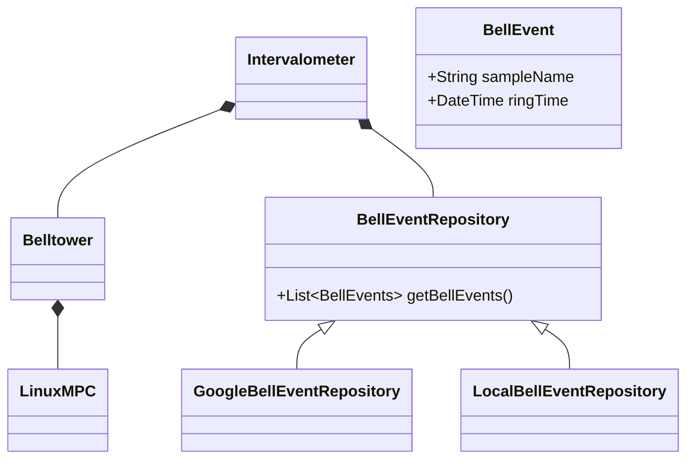

# bells Project

This project is quarkus based bell-tower server.

Features:
- obtains bell schedule from google calendar
- caches bell schedule

# Configuration
belltower.calendar.query.lookAhead - on query to calendar,
obtain events from now until the look ahead value.
The look ahead value is expressed as in a string formmated
as according to [Java Duration#parse](https://docs.oracle.com/javase/8/docs/api/java/time/Duration.html#parse-java.lang.CharSequence)

belltower.call-to-mass.duration - The time to start the 'call-to-mass'
bell sequence.
The event on the schedule is spelled 'mass',
and 'call-to-mass' bells are started this duration before the time
of the 'mass' event.
This is convenience so the calendar need only to detail
the time mass starts.
The belltower program has a special rule for this event:
start the bells some duration before start of mass.
This duration is expressed in a string formatted according
to [Java Duration#parse](https://docs.oracle.com/javase/8/docs/api/java/time/Duration.html#parse-java.lang.CharSequence)

belltower.calendar.id - the id of the google calendar from which scheduled events are read.

belltower.calendar.path.client-secrets - path to json file which holds credentials to

belltower.mpd.port - port to send mpc requests, defaults to 6600.

belltower.mpd.host - host to send mpc requests, defaults to localhost.

# Bell ringing

Two techniques are available to ring bells.
One for fixed duration, and another for a duration that is controllable.

Fixed duration is useful to play a song or to ring bells for constant amount of time.
It is a single mp3 media file.

Controllable duration is implemented with three mp3 media samples:  beginning, middle and end.
The beginning sample is played first.
The middle is played repeatedly for some number of iterations.
Then, the end is played.
After the end sample, the bell ringing event is complete.
The duration is controllable by varying the number of iterations of the middle sample.
The samples are carefully edited for seamless transitions between the samples.

# Event Requirements

Events with the name 'mass' will schedule the 'call-to-mass' sample.

## Ring Event Schedule

A 'ring event' or 'event' is a scheduled ringing of the bell.
Bells can be scheduled.

A default schedule can be defined as program configu8ration.
It is not changeable while the program runs.
Dynamic scheduling can be performed only from remote calendar.
So far, only Google Calendar is supported.

## Remote Calendar

If the remote calendar is not configured or not available,
use the default ring event schedule.

### Google Calendar Query Requirements

Access a calendar using google calendar api.
Query the google calendar by the id given in configuration.
Obtaining authorization to the calendar is provisioning step at install time.

The google calendar is queried on configurable interval to obtain the ring schedule.

# Class Design

## Intervalometer
The Intervalometer class will start ringing bells (by playing bell samples)
at intervals calculated from the bell events on the BellCalendar.

An intervalometer is some device which can trigger events over some specific interval.
An intervalometer may be familiar to photographers and bombers.

## BellCalendar
The BellCalendar is a list of BellEvents.

A BellEvent identifies a bell sample 
and the time the sample is meant to be rung.

## Belltower

The Belltower drives an external media player to play the bell sample.

Currently, the only media player supported is Music Player Deamon, MPD.
MPD is a well known linux media player service.
The command line tool 'mpc' can control the player.
The Belltower sends the same commands that mpc would send to the MPD.
The Belltower component sends MPC commands to the configured MPD player.

The external media player will drive the audio subsystem to
play the sample on the audio device.
The audio device should be preconfigured
and the media player loaded with samples and verified
before the media player can successfully play the sample.



## Running the application in dev mode

You can run your application in dev mode that enables live coding using:
```shell script
./mvnw compile quarkus:dev
```

> **_NOTE:_**  Quarkus now ships with a Dev UI, which is available in dev mode only at http://localhost:8080/q/dev/.

## Packaging and running the application

The application can be packaged using:
```shell script
./mvnw package
```
It produces the `quarkus-run.jar` file in the `target/quarkus-app/` directory.
Be aware that it’s not an _über-jar_ as the dependencies are copied into the `target/quarkus-app/lib/` directory.

The application is now runnable using `java -jar target/quarkus-app/quarkus-run.jar`.

If you want to build an _über-jar_, execute the following command:
```shell script
./mvnw package -Dquarkus.package.type=uber-jar
```

The application, packaged as an _über-jar_, is now runnable using `java -jar target/*-runner.jar`.

## Creating a native executable

You can create a native executable using: 
```shell script
./mvnw package -Pnative
```

Or, if you don't have GraalVM installed, you can run the native executable build in a container using: 
```shell script
./mvnw package -Pnative -Dquarkus.native.container-build=true
```

You can then execute your native executable with: `./target/bells-1.0.0-SNAPSHOT-runner`

If you want to learn more about building native executables, please consult https://quarkus.io/guides/maven-tooling.html.

## Related Guides


## Provided Code

### RESTEasy Reactive

Easily start your Reactive RESTful Web Services

[Related guide section...](https://quarkus.io/guides/getting-started-reactive#reactive-jax-rs-resources)
