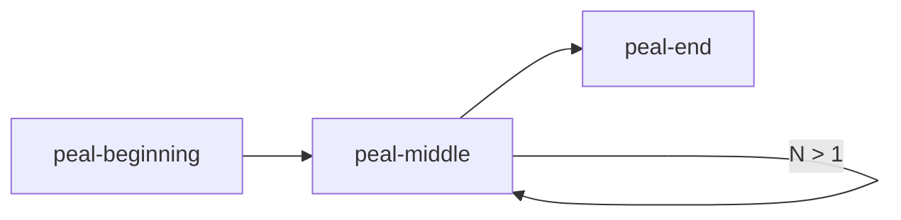
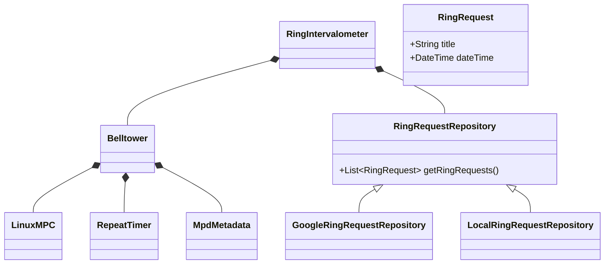
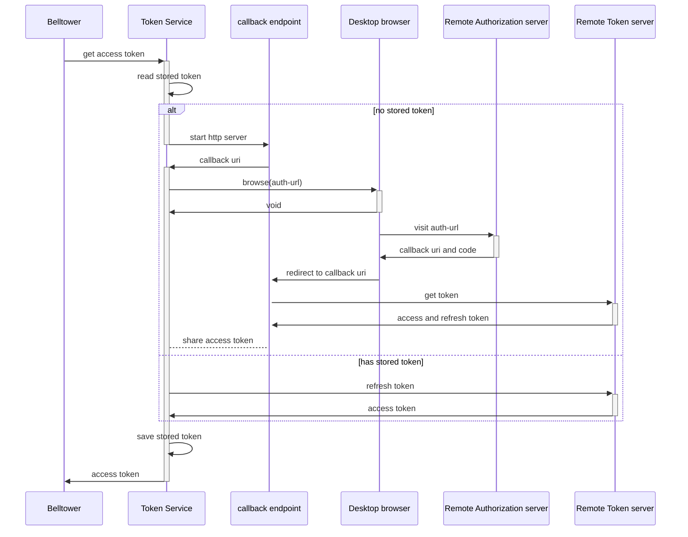

# belltower Project

Plays bell samples on-demand or automatically by a schedule.
The system is customized for use by a faith community to ring bells,
or other suitable sound samples,
for various liturgical occasions.
The software may be unsuited for other applications.

The project does not include audio amplifier or speakers.
This project produces only computer software.


## Runtime Requirements

The belltower program requires the following at runtime:
- an audio sound system: amplifier and speakers
  - with audio input to match the signal presented by the computer below
  - with volume and optionally mixing controls
  - with speakers, sized and mounted appropriately for desired reach of the playback.
- a desktop computer or a single-board computer running linux
  - with internet access
  - with a sound card and audio output to match the signal required by the sound system above
  - a display screen
- linux operating system on the computer with some configuration and software, including
  - java runtime
  - mpd (music player daemon)
  - appropriate audio configuration to drive the sound card output suited for the audio sound system.

## User Stories

As a bell ringer, I'd like to 'ring', or play, media samples of bells,
to increase the sense of community of a congregation,
and to retain the tradition of ringing bells after replacing actual bells with modern technologies.

As a bell ringer, I'd like to schedule bell samples to ring automatically,
so I can be relieved of the manual chore of ringing the bells manually.

As a bell ringer, I'd like to ring bells manually on demand,
so they can sound at times which are not planned and scheduled.

As a bell ringer, I'd like to have different bell samples available to play,
so that the bells sounded are appropriate for the occasion.

As an administrator, I'd like to manage user base and grant privileges
to single or groups of users.
To each user, I'd want to grant one or more of the following permissions:
- read access to the online schedule
- write access to the online schedule
- ring wedding bell at will during scheduled wedding
- ring funeral toll at will during scheduled mass
- ring wedding bell at any time except blocked time.
- ring funeral tool at any time except blocked time.
# Configuration
belltower.calendar.query.lookAhead - on query to calendar,
obtain events from now until the look ahead value.
The look ahead value is expressed as in a string formatted
as according to [Java Duration#parse](https://docs.oracle.com/javase/8/docs/api/java/time/Duration.html#parse-java.lang.CharSequence)

belltower.intervalometer.schedule.refresh.period:2h
The period between refreshes of the schedule from
all source.  Default is 2 hours.

belltower.call-to-mass.duration - The time to start the 'call-to-mass'
bell sequence.
The event on the schedule is spelled 'mass',
and 'call-to-mass' bells are started this duration before the time
of the 'mass' event.
This is convenience so the calendar need only to detail
the time mass starts.
The belltower program has a special rule for this event:
start the bells some duration before start of mass.
This duration is expressed in a string formatted according
to [Java Duration#parse](https://docs.oracle.com/javase/8/docs/api/java/time/Duration.html#parse-java.lang.CharSequence)

belltower.calendar.id - the id of the Google calendar from which scheduled events are read.

belltower.mpd.port - port to send mpc requests, defaults to 6600.

belltower.mpd.host - host to send mpc requests, defaults to localhost.

belltower.peal.duration.default - default overall duration in seconds of the
variable bell patterns.  defaults to 60 (i.e, one minute)

belltower.security.oauth2.CodeCallbackEndpoint.waitTime - the length of time the callback endpoint is active before it shutsdown waiting for callback.
belltower.security.oauth2.CodeCallbackEndpoint.path - the path parameter of the callback endpoint.  Defaults to 'callback'.
belltower.security.oauth2.CodeCallbackEndpoint.stateLength - the number of characters in the generated oauth2 state query parameter.  Defaults to 30.

# Control surfaces

The belltower supports ringing on demand,
or on some interval (at 7:30 every morning),
or at specific dates and times in the future (4 pm on Christmas Eve, 2020).

Note: intention to offer web based control with https,
and embedded local control with a UI based on javafx.
* on demand by embedded local control
* by interval or on singular date and time by remote calendar.

# Media samples

The belltower is essentially a media file player with a built-in schedule.
The media files contains audio samples of some sequence of pealing bells.

The samples should be clean without backend noise like city traffic or conversations.

The samples can be proprietary and created by a sound engineer.
Samples unencumbered by restrictive copyrights are distributed with the software.

The tower can work with two kinds of samples:
* a fixed duration sample: 
playback of a single sample file from beginning to end.

* a variable duration sample:  three samples are played back in sequence
and the middle sample is repeated until the requested peal duration expires.
The duration of play back is the sum duration of the segments: beginning, middle x repeats, end.
The technique requires careful editing of the three samples for seamless playback.

# Remote control

Some controls can be accessed remotely and securely through connections to the Internet.

- remote scheduling allows a user to change the bell schedule remotely.
- remote bell sample control allows a user to play and stop samples remotely.

# Ringing bells

The ringing of bells can be driven by calendar entries.
Users may want bells to ring at certain times at certain days.
They would access a calendar widget or remote calendar,
specify an absolute or repeatable date and time
and the ring sample name.

## Event Requirements

Events with the name 'mass' will schedule the 'call-to-mass' ring sample,
at some configurable offset time before time of the event.

## Ring Event Schedule

A 'ring event' or 'event' is a scheduled ringing of the bell.
Bells can be scheduled.

A default schedule can be defined as program configuration.
It is not changeable while the program runs.
Dynamic scheduling can be performed only from remote calendar.
So far, only Google Calendar is supported.

## Remote Calendar

If the remote calendar is not configured or not available,
use the default ring event schedule.

### Google Calendar Query Requirements

Access a calendar using google calendar api.
Query the Google calendar by the id given in configuration.
Obtaining authorization to the calendar is provisioning step at install time.

The Google calendar is queried on configurable interval to obtain the ring schedule.

# Class Design

## RingRequest and RingEvent
A RingRequest is created from user input.
The RingRequest comes from external data sources including Google,
or a file.

A RingEvent is internalization of a RingRequest.
It specifically and concretely identifies the time and name of each ring sample.

As convenience:
* when the title of a RingRequest is 'mass',
the bell sample title and time are generated automatically to
pre-configured values.

There is room for extension here.
In the future, other constructs of the RingRequest can be defined
for the convenience of the user.
For example, a title of 'wedding' could be introduced
as way to conveniently specify the wedding peal sample.

The RingEventFactory would be changed to support future extensions.
It interprets the RingRequest's title to create an intended RingEvent.

## RingIntervalometer
The RingIntervalometer class will automatically
ring bells
at intervals calculated from the ring requests on the BellCalendar.

An intervalometer is some device which can trigger events over some specific interval.
An intervalometer may be familiar to photographers and bombers.

## RingRequestRepository
The RingRequestRepository storage for the user's requests to ring the bells.

The repository can be remote, for example the Google calendar API.

Extensions are expected but not currently delivered.
Possible extensions are to an Office 365 calendar API,
or a local file.

## Belltower

The Belltower can:
- start playing bell samples,
- stop playing bell samples,
- get status of the underlying media player.

### RepeatTimer

The RepeatTimer is used by Belltower to control the variable duration peals.

The RepeatTimer requires three sample segments of the peal:
a beginning, middle and an end.

The peal can stretch by repeating the middle segment.
The middle segment will be repeated until the peal's length matches what is requested.

In a case where each segment is 10 seconds long, then including the beginning and the end segments (20 secs),
1. a 60-second peal is attained by playing the middle segment 4 times (40 secs).
2. a 120-second peal is attained by playing the middle segment 10 times (100 secs).

The length of the peal can vary by the number of times the middle segment is repeated.





For MPD, RepeatTimer uses timers to control the repeats.
The timer handlers send commands to MPD to start repeats, and to stop repeats.
The timers' expiration are calculated from the lengths of beginning and middle segments.
The length of each segment is obtained from the audio player.
The audio player can provide most accurate length if it decodes the audio samples,
extracts duration and make it available to the bell tower with an API.
MPD gives the duration as part of song metadata which is parsed by the class MpdMetadata.

Currently, RepeatTimer cannot support any other playback device.
It works only with MPD.

### Create Variable Bell Peals
To create the 3 segments of a variable bell peal:
1. Select an existing bell sample that demonstrates at least 3 cycles.
2. Open the sample in an audio editor.
3. Cut out and save the first cycle.  Example name of the file: 'peal-beginning.ogg'.
4. Cut out and save a middle cycle.  Filename: 'peal-middle.ogg'.
5. Cut out and save the last cycle.  Filename: 'peal-end.ogg'. 

The filenames for segment of a peal MUST have the same root name, and the name of the segment it contains.
The root name of the peal appears first.
The segment of the peal follows the root and precedes the extension.
The peal's segments MUST contain the string '-beginning', '-middle', or '-end'.
The extension of the file name is the audio format, in this case 'ogg'.

Examples of variable peal segment filenames:
1. for a wedding peal: wedding-peal-beginning.ogg, wedding-peal-middle.ogg, wedding-peal-end.ogg.
2. for a funeral toll: funeral-toll-beginning.ogg, funeral-toll-middle.ogg, funeral-toll-end.ogg.

The segments must be carefully edited to playback without audio seams.
Seams in the audio ruin the illusion created by the recorded bells.

For seamless playback:
1. Each segment should contain at most one cycle of the bell peal.
2. The attack of the middle and end segments must be identical.
3. The release of the beginning and the middle segments must be identical.
4. The release of the beginning and middle segments must fit the attack of the middle and end segments respectively.
5. Pitch, amplitude and other sound characteristics must be identical across all three samples.
6. A long fadeout can be tolerated only in the release of the end segment. 
7. Only the bell sample should appear in the segments.
Any silence or noise before the peal's attack in the beginning segment or after the peal's release in the end segment
should be trimmed off.
Silence, if unavoidable, can be tolerated before the attack of the beginning segment,
or after the release of the end segment,
and should be no longer than tenth of a second.  Noises in any segments which are not bells will ruin the illusion.

After some experience, you may see some reason to experiment and break rules of the above recipe.
In reality, the peal can be understood as a serial playback of three audio files, with the middle repeated.
The rules of the composition is only that:
1. the middle's attack can follow seamlessly from the beginning's and its own release,
2. the end's attack can follow seamlessly from the middle's release.
3. and the segments be short enough to make sense in the setting as a bell peal.

If you want to break even those rules, you're on your own.
Belltower may be unsuited.
Perhaps, you would want a player piano?


### Commands

- status: obtain certain interesting status from the media player
- ring: play a named bell sample of fixed or variable length
- lock: prevent ring from operating
- unlock: allow ring to operate


### Media Player

The actual media player is external to the belltower.
The belltower sends control signals to the actual media player.

Currently, the only media player supported is Music Player Deamon, MPD.
Capability to use a different player is not a goal of belltower at this time.

The command line tool 'mpc' can control the MPD player.
The Belltower component sends commands to the configured MPD player
over a network connection or unix socket.

The media player will drive the audio subsystem to
play the sample on the audio device.
The audio device should be preconfigured
and the media player loaded with samples and verified
before the media player can successfully play the sample.



# MPD Media Player configuration

- disable state file, or use 'restore_paused yes'
  When MPD restarts after unexpected outage, it must be quiet.
  After restart, MPD should await next commands from belltower before playing anything.
- crossfade, or xfade, should be set to 0.
  TODO: confirm MPD default value of crossfade is 0.
- 
  If crossfade is not zero, the variable bell samples will overlap during playback.
  At crossfade 0, bell samples playback will not overlap.

# OAuth2 authorization with remote calendar systems (like Google API)
An OAuth2 authorization flow is use to get an access token.
The access token is bell towers authorization to use remote calendar api.
Belltower qualifies as a native app with persistent client id and secret.

Belltower uses internal class 'Token Service' to obtain a token.
If there is a stored token is not available,
Token Service will attempt
to obtain an access token from
the remote OAuth2 token server.

Token Service enables or activates a callback endpoint.
Design decision pending: Sharing memory or send message from
callback endpoint to Token Service.

The next step in this OAuth2 flow is to obtain an authorization code.
The Token Service uses java.awt.Desktop to browse to the authorization service.
The browser 'visits' the authorization url.

The authorization service will obtain authorization from the resource owner.
The resource owner had earlier granted authorization to this client id/secret.

The authorization service would return an authorization code in a redirect response (3xx).
The response includes an url with authorization code as a query parameter.
The url is in the Location header of the response.
The url redirects to the callback endpoint.
The browser visits the callback endpoint.

The callback endpoint exchanges
the authorization code for an access token (and refresh token).
It sends the code to the remote token server
which returns the access token and refresh token.

The callback endpoint then provides the access token to the Token Service.
The Token service stores the token,
and returns the token back to Belltower
which can then send it to the remote calendar api for authorized access.

The Token Service may detect that the token had expired.
It must request a refreshed access token.
It will send a request to the remote token server to refresh the token.



## Running the application in dev mode

You can run your application in dev mode that enables live coding using:
```shell script
./mvnw compile quarkus:dev
```

> **_NOTE:_**  Quarkus now ships with a Dev UI, which is available in dev mode only at http://localhost:8080/q/dev/.

## Packaging and running the application

The application can be packaged using:
```shell script
./mvnw package
```
It produces the `quarkus-run.jar` file in the `target/quarkus-app/` directory.
Be aware that it’s not a _über-jar_ as the dependencies are copied into the `target/quarkus-app/lib/` directory.

The application is now runnable using `java -jar target/quarkus-app/quarkus-run.jar`.

If you want to build a _über-jar_, execute the following command:
```shell script
./mvnw package -Dquarkus.package.type=uber-jar
```

The application, packaged as a _über-jar_, is now runnable using `java -jar target/*-runner.jar`.

## Creating a native executable

You can create a native executable using: 
```shell script
./mvnw package -Pnative
```

Or, if you don't have GraalVM installed, you can run the native executable build in a container using: 
```shell script
./mvnw package -Pnative -Dquarkus.native.container-build=true
```

You can then execute your native executable with: `./target/bells-1.0.0-SNAPSHOT-runner`

If you want to learn more about building native executables, please consult https://quarkus.io/guides/maven-tooling.html.

## Related Guides


## Provided Code

### RESTEasy Reactive

Easily start your Reactive RESTful Web Services

[Related guide section...](https://quarkus.io/guides/getting-started-reactive#reactive-jax-rs-resources)
